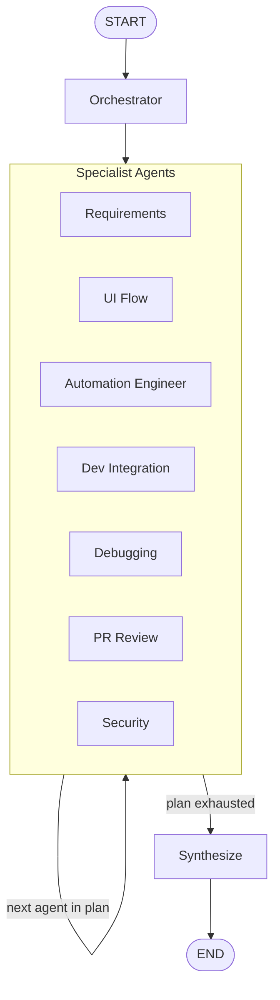

# Workflow Diagram

The graph follows a supervisor pattern: the Orchestrator plans which specialists are
needed, the graph loops through that plan one specialist at a time (each one reading
and extending shared state), then falls through to a synthesis step once the plan is
exhausted.

This is a simplified view of the actual mechanics, not a literal diagram of every
edge in the code. In `../graph/qa_workflow_graph.py`, each of the 7 agents (plus the
Orchestrator) has its own conditional edge computed by `route_next`, which reads
`plan`/`current_step` from the shared `QAWorkflowState` and returns whichever agent
is next. In practice that means any agent can transition to any other agent, in
whatever order the Orchestrator decided, looping until the plan is exhausted, which
is what the single "Specialist Agents" box and its self-loop above represent.
