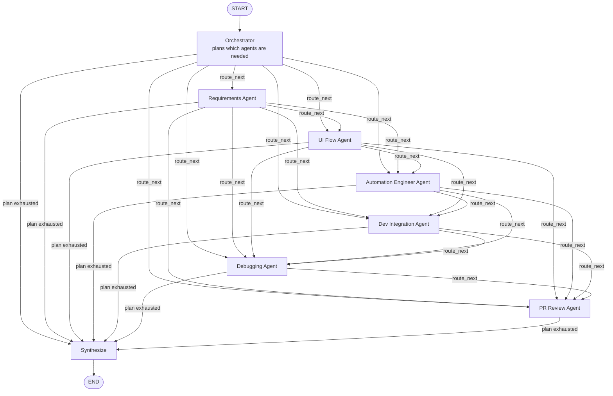

# Workflow Diagram

The graph follows a supervisor pattern: the Orchestrator plans which specialists are
needed, the graph loops through that plan one specialist at a time (each one reading
and extending shared state), then falls through to a synthesis step once the plan is
exhausted.

Every specialist node and the orchestrator share one state object
(`QAWorkflowState` in `../graph/qa_workflow_graph.py`): `task`, `plan`,
`current_step`, `agent_outputs`, `final_output`. `route_next` reads `plan` and
`current_step` after every node to decide where to go next — so the actual path
through the graph depends entirely on what the Orchestrator decided the task needs,
not a fixed sequence. Every agent can transition to every other agent in principle;
which edges actually get taken for a given run depends on the Orchestrator's plan.
