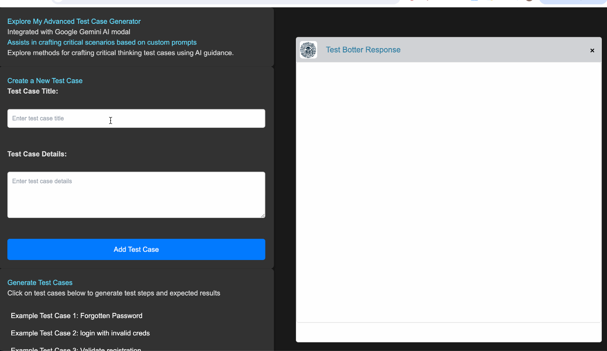

# Test Botter 

## Description

**Test Botter**  is a tool I designed to assist in generating test cases using AI. It leverages custom prompts to generate common test cases or get it to come up with some out of the box scenarios for your features - this is for helping quality assurance engineers streamline their testing processes. More features are coming soon to further enhance the capabilities of this tool. I don't want this to just be a test case generator, it will contain more AI-QA related features. 

I created this tool utilizing Google Gemini AI Modal - to help with testing, providing an AI bot that you can reach out to for assistance whenever needed.





## Features

- Generate common test cases using custom prompts
- User-friendly interface for interacting with the AI
- Efficient and quick test case generation
- More features coming soon...


## Installation and Setup

1. **Clone the Repository**
```bash
git clone [repository-url]
```

2. **Install Dependencies**
Navigate to the project directory and install the required dependencies:
```bash
npm install
```

3. **Set Your API Key**
This app reads the key from a local `config.js` file (not a `.env` var), which is
gitignored so it never gets committed. Create it in this folder:
```bash
echo "export const API_KEY = 'your_api_key_here';" > config.js
```
Get a key from [Google AI Studio](https://aistudio.google.com/apikey).

4. **Run the Application**
Start the application locally:
```bash
npm run dev
```

5. **Open in Browser**
Vite will print the local URL (default `http://localhost:5173`). Open it in your
browser.

## Usage

 - **Enter Your Details:** Fill in the input fields with your test case details and descriptions, then click "Add Test Case" to add them to the list below.

 - **Generate Test Scenarios:** Choose test cases from the list to have the AI generate detailed scenarios based on them.

 - **Customize Test Cases:** For permanent test cases, you can directly edit the JSON file with your custom prompts.

 - **Personalize Your AI:** Have fun by giving your AI a personality that makes interactions enjoyable!

